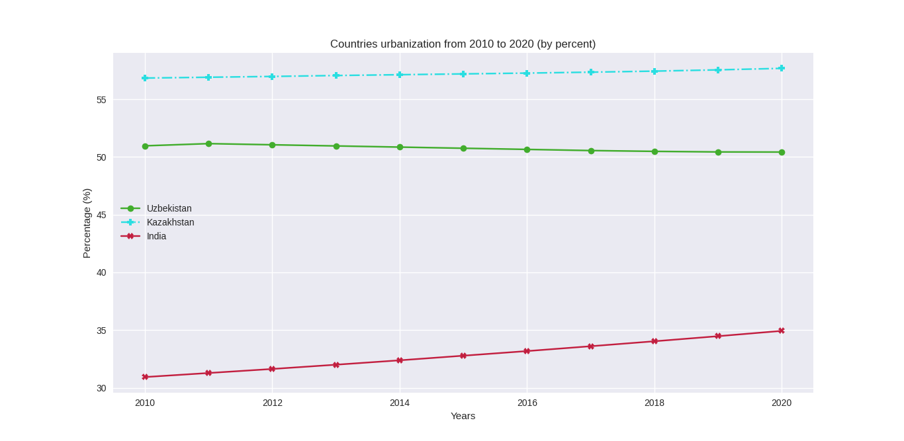
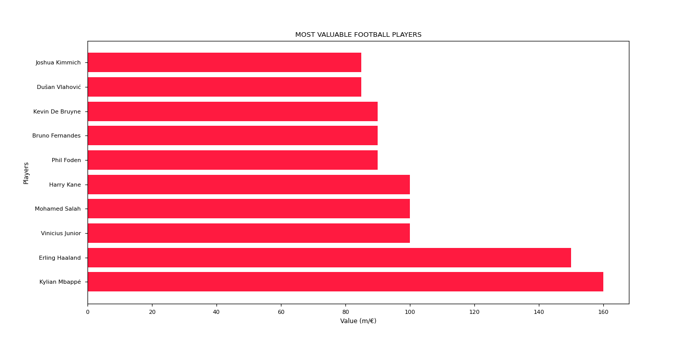
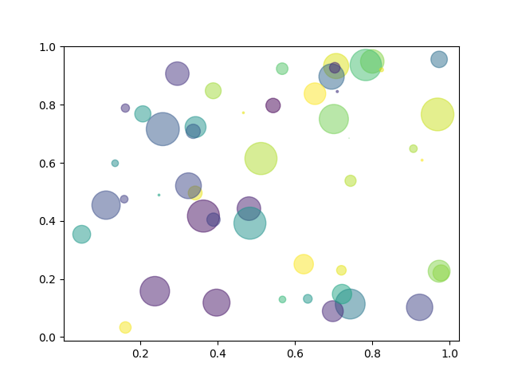
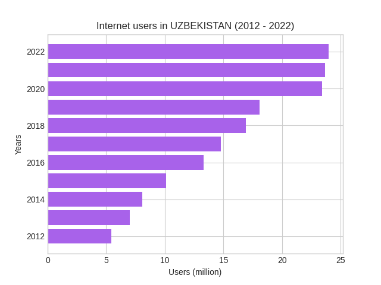

# Data vusualization using MATPLOTLIB

**EXAMPLES**

[South America countries](South%20america.py)

[Popular languages](programming_languages.py)

[Countries urbanization](Urbanization.py)

[Most valuable football players](valuable_players.py)

[Basic scatter plot example](./scatter.py)

[Internet users in UZBEKISTAN](./internet-users-uzbekistan.py)
